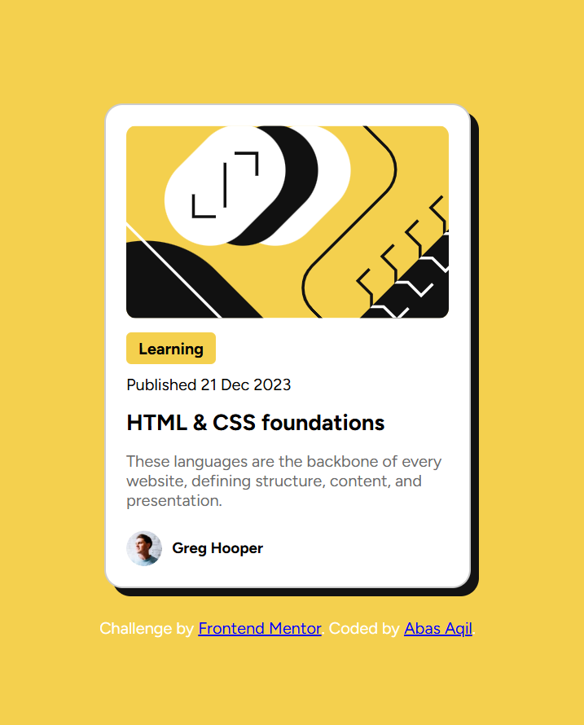

# Frontend Mentor - Blog Preview Card

## 📖 Overview

This is my solution to the **Blog Preview Card** challenge on Frontend Mentor.

The goal of this project was to build a responsive blog card component that matches the provided design using HTML and CSS.

---

## 🚀 Technologies Used

* HTML5
* CSS3
* Flexbox
* Responsive Design
* Google Fonts

---

## 🎯 What I Learned

During this project, I practiced:

* Building reusable card layouts with CSS
* Using Flexbox for alignment
* Working with custom fonts
* Creating shadows, borders, and rounded corners
* Improving spacing and typography
* Making a design closer to a professional UI

---

## 🔗 Live Demo

https://abas-aqil.github.io/blog-preview-card/

---

## 💻 GitHub Repository

https://github.com/Abas-Aqil/blog-preview-card

---

## 🏆 Frontend Mentor Solution

https://www.frontendmentor.io/solutions/your-solution-link

## 👤 Author

**Abas Aqil**

* GitHub: https://github.com/Abas-Aqil
* Portfolio: https://abas-aqil.github.io
* Frontend Mentor: https://www.frontendmentor.io/profile/Abas-Aqil

---

## 🙏 Acknowledgements

Challenge provided by Frontend Mentor.

Built as part of my journey to improve my frontend development skills through consistent practice.
